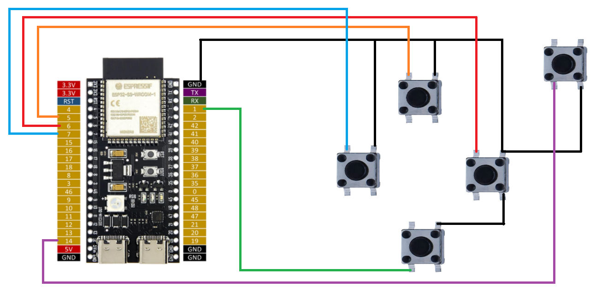

# ESP32-S3 USB HID Button Keyboard
A simple and beginner-friendly project to get started with USB HID and keystrokes using ESP32-S3.

## 🧠 Features
- Press physical buttons → send arrow keys ↑ ↓ ← → (or remap to W A S D)
- Sends a lowercase `e` on button press (with debounce delay)
- USB HID (no extra driver needed)
- Built with Arduino framework

## 🛠️ Hardware Used
- ESP32-S3 board (with native USB)
- 5x push buttons
- Jumper wires + breadboard

## 📷 Wiring
- Follow this table or customize in the code  
- Connect one side of each button to GND  
- All buttons use `INPUT_PULLUP`

| Button | GPIO Pin |
|--------|----------|
| UP     | 5        |
| DOWN   | 1        |
| LEFT   | 7        |
| RIGHT  | 6        |
| E      | 14       |

## 🧪 How It Works
- The ESP32-S3 reads the state of each button
- If pressed, it sends the mapped keyboard key over USB HID
- Real-time sync between physical button and PC key state
- 'E' button acts like a short tap key (auto-release after 500ms)

## 💾 Code
File: `esp32-usb-hid-buttons.ino`  
Flash with Arduino IDE using ESP32 board manager + proper USB settings.

## 📸 Schematic

